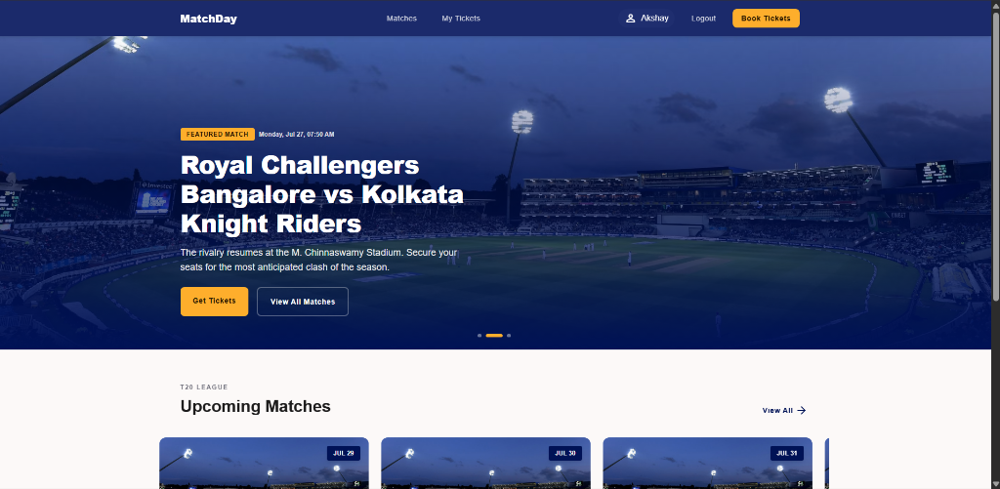
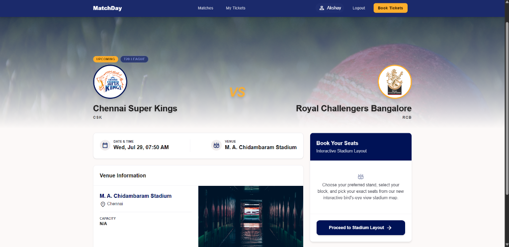
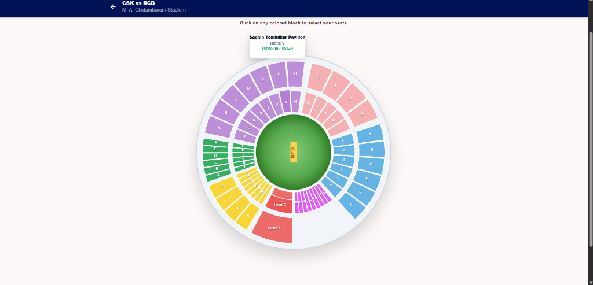
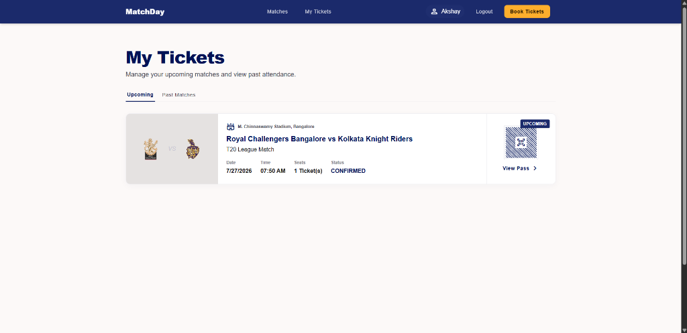
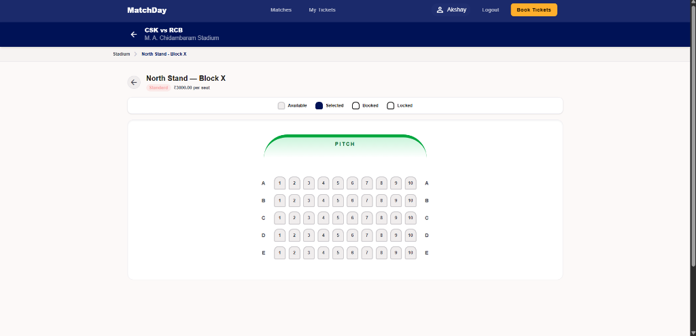

# MatchDay | IPL Ticket Booking Platform

MatchDay is a high-performance, real-time ticket booking platform designed for high-traffic sports events like the Indian Premier League (IPL). Built with a focus on premium user experience, transaction security, and real-time responsiveness, it scales effectively to handle thousands of concurrent bookings.

---

## 📸 Screenshots

Here is a preview of the MatchDay interface:

### 1. Home Page & Live Featured Matches
Displays live and upcoming IPL matches with an interactive featured match carousel.


### 2. Match Details & Booking Entry
Shows complete venue description, match date/time, and has the checkout booking entrance.


### 3. Stadium Stand Block Selector
Presents a circular stadium layout split by color-coded price points and stand regions.


### 4. Interactive Seat Grid Map
Provides row-by-row seat layouts with a real-time status legend. Selected/Locked/Booked seats update dynamically.


### 5. My Tickets Pass
Lists user-confirmed reservations with ticket counts, status badges, and direct links to digital pass QR codes.


---

## 🛠️ File Structure

The project is split into a client-server architecture with Docker environment configurations:

```text
IPL Booking/
│
├── client/                     # Frontend Application (Vite + React)
│   ├── public/                 # Static assets
│   │   └── logos/              # Local team logos (CSK, MI, SRH, etc.) and favicons
│   ├── src/
│   │   ├── components/         # Reusable UI widgets (SeatGrid, BlockSelector, etc.)
│   │   ├── pages/              # Main routing views (Home, Matches, SeatSelection, TicketDetail)
│   │   ├── services/           # Axios API services
│   │   └── index.css           # Styling configuration (Custom HSL theme variables)
│   └── index.html              # Entry HTML
│
├── server/                     # Backend API (Node.js + Express)
│   ├── src/
│   │   ├── config/             # Environment, Database & Supabase connection configs
│   │   ├── controllers/        # Controllers (Auth, Bookings, Matches, Payments)
│   │   ├── middlewares/        # Express JWT Auth & Admin middlewares
│   │   ├── routes/             # REST route bindings
│   │   └── index.js            # Express app entry and Socket.io binding
│   ├── scripts/
│   │   └── seed_stadiums.js    # Database matching and seats seeding script
│   ├── Dockerfile              # Docker container setup for backend
│   └── init.sql                # Complete DB schema and initial team seeds
│
├── database/                   # Standalone Database Reference Files
│   ├── schema.sql              # Clean PostgreSQL tables definition
│   └── seed.sql                # Clean initial team and stadium seed inserts
│
├── nginx/                      # Nginx Load Balancer Configuration
│   └── nginx.conf              # Round-Robin load balancer routing configuration
│
├── docker-compose.yml          # Container configuration (Postgres, Redis, 3x Server Replicas, Nginx)
├── setup.bat                   # Automated installation & seeding script for Windows
└── README.md                   # Project documentation
```

---

## 🚀 Step-by-Step Installation

### Automated Local Setup (Windows)

We have bundled all installations, database schema initializations, and data seedings into a single Windows batch file:

1. Make sure you have **Docker Desktop** running.
2. In the project root directory, run the setup script:
   ```cmd
   .\setup.bat
   ```
3. The script will automatically:
   * Verify Node.js and Docker are installed.
   * Copy `.env.example` -> `.env` configuration files.
   * Start `docker compose up -d --build` to deploy PostgreSQL, Redis, Nginx, and 3 Server replicas.
   * Wait for the containers to boot and build the database tables (`init.sql`).
   * Seed the database with 8 unique matches and 28,800 seats (`seed_stadiums.js`).
   * Install client dependencies locally.

4. Once the setup script completes, start the client dev server:
   ```cmd
   cd client
   npm run dev
   ```
5. Open `http://localhost:5173` in your browser.

### 📧 Email Verification & SMTP Test Mode

Our platform includes email OTP verification during user registration. This is configured in `server/.env` via SMTP credentials:

* **Production Mode**: Input your SMTP server credentials (e.g., Brevo) in the `.env` file to send live email confirmations.
* **Test/Development Mode**: If the SMTP credentials (`SMTP_USER`, `SMTP_PASS`) are left blank or omitted, the server automatically defaults to **Test Mode**.
  * The API request completes successfully without throwing mail exceptions.
  * The generated OTP code is logged directly inside the backend server logs/terminal console:
    ```text
    [DEV MODE] SMTP not configured. OTP for user@example.com is 123456
    ```
  * You can simply copy this OTP from the console and enter it in the web verification form to complete registration instantly!

---

## 🔒 Security & Performance Features

### 1. High-Traffic Seat Locking (Redis `SETNX`)
To prevent double bookings and race conditions when multiple users click the same seats, we use an in-memory Redis lock. As soon as a user clicks a seat in the UI, the backend attempts to write a lock in Redis with a 5-minute expiration time. This immediately marks the seat as `LOCKED` for all other clients in real-time via WebSockets, ensuring seamless transaction isolation.

### 2. Transaction Integrity & Prefilled Payments
The Razorpay checkout integration is secured end-to-end:
* Prefills the payment widget with the logged-in user's `name`, `email`, and `phone` for custom billing.
* Enforces strict backend validation on payment verification (`verifyPayment`), checking that the transaction belongs to the authenticated user before marking the booking as `CONFIRMED`.

### 3. Signed JWT Ticket QR Codes
Upon successful payment, tickets are generated with unique QR codes containing signed JWTs. This prevents users from fabricating ticket details or tampering with QR scanner payloads at the turnstile.

### 4. Git Credentials Protection
The root `.gitignore` is configured to prevent committing `.env` files, keeping environment configurations and private API keys protected from public repositories.

---

## 📈 Scalability & High-Concurrency Architecture (30,000 Concurrent Users)

Handling 30,000 concurrent users on a ticket booking site—especially during sudden spikes when ticket windows open—requires a highly optimized write-path and efficient request load-balancing. Our architecture achieves this through the following layers:

### 1. Reverse Proxy & Round-Robin Load Balancing
* **Nginx Load Balancer**: Sits in front of the backend layer, receiving all incoming API requests and distributing them across the Node.js server replicas.
* **Horizontal Scaling (Express Replicas)**: Since Node.js is single-threaded, we run **3 horizontal replicas** of our Express container (which can be scaled to 30+ instances in production environments like AWS ECS or Kubernetes). Nginx dynamically balances traffic across these replicas, keeping CPU utilization evenly distributed.

### 2. High-Performance Caching & Memory-Locked Seats
* **Redis `SETNX` Lock Isolation**: Querying the database to check if a seat is available during peak times would quickly saturate the PostgreSQL connection pool. By using Redis in-memory locks, availability checks are executed in sub-millisecond times on Redis.
* Only users who successfully acquire the 5-minute memory lock can proceed to the payment gate. This filters out 95% of write requests, shielding the database from raw lock contention.

### 3. PostgreSQL Database Scaling
* **Connection Pooling**: The backend is configured to use database connection pooling (`pg-pool`). In a full-production environment, this is paired with **PgBouncer** to handle tens of thousands of active client connections without crashing PostgreSQL's memory.
* **Targeted Query Indexing**: We created explicit indices like `idx_matchseats_match_status` and `idx_bookings_user_id`. Queries like retrieving seat grids are executed as index-scans in $O(\log N)$ time, preventing table scans.
* **Primary-Replica Split**: In production, the database uses one primary node for write transactions (checkout and payment confirmations) and multiple read replicas for match listings and seat map views. Since 90% of concurrent traffic is browsing rather than buying, read replicas absorb the bulk of the query load.

---

## ⚠️ Major Problems Faced & Resolutions

### 1. Wikimedia Hotlinking Block & CORS Errors
* **Problem:** In our initial schema, team logos were hotlinked directly from Wikimedia Commons. During testing, the browser failed to load images due to CORS blocks, and Wikimedia returned `429 Too Many Requests` errors when downloading them.
* **Resolution:** We searched and downloaded high-quality official logos directly into `client/public/logos` and updated the database to use relative path URLs (e.g. `/logos/srh.svg`). Since Vite serves the `public` directory at the root, the browser loads these assets instantly and locally.

### 2. Match Venue Duplication
* **Problem:** The initial seeding setup created the same matches (e.g. MI vs CSK) across all stadiums simultaneously on the exact same date. This felt unrealistic.
* **Resolution:** We restructured `seed_stadiums.js` to create 8 distinct matches distributed across different venues and dates (e.g. MI vs CSK at Wankhede, RCB vs KKR at Chinnaswamy).

### 3. Nested Seat API Path Error
* **Problem:** On the ticket confirmation page, the seat number was displaying as `-` and the block was showing `N/A`. The frontend was looking for `booking.seats[0].seat` which did not match the backend's nested database join representation.
* **Resolution:** We traced and updated the frontend path to `booking.seats[0].match_seat.seat` and implemented multi-seat formatting (e.g. `A-1, A-2`) to cleanly show all tickets booked in a transaction.
